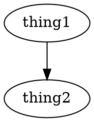
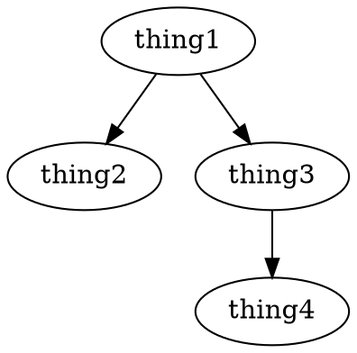
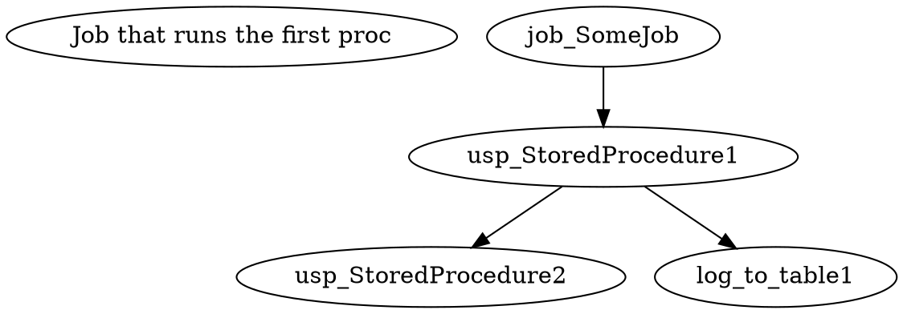
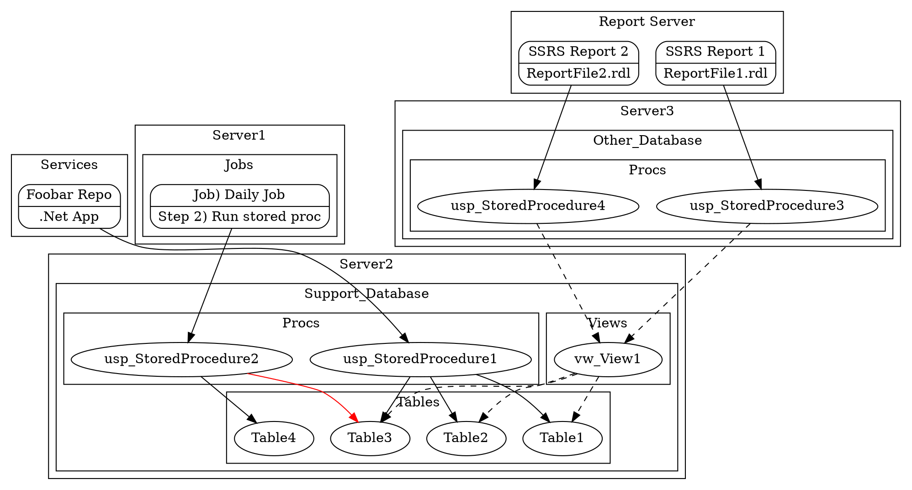

Today I was tracing through a chain of SQL stored procedures, tables, views, jobs, windows services, etc. I was beginning to forget which things were calling other things. It spanned multiple databases on multiple servers.

To get a better idea of what I was looking at I decided to throw together a quick visual diagram. This is something I do a lot when I'm tracing through code, or if I'm trying to work out a very basic structure of how something should work. There's tons of ways to do this...pen and paper, notepad, flowchart/diagramming software including both paid and free ones. There's also tons of websites that offer tools for this.

> Warning: For any graphviz experts reading, I might get some terminology wrong here. I tried googling around, but it was hard to tell if "DOT" the language was different from "dot" the rendering layout engine (similar to neato, fdp, twopi).

My personal favorite is called DOT, which is a graph description language. Along with DOT, I use Graphviz, which is a library of programs for converting the DOT code into the visual graph.

This might sound intimidating, and I thought so too at first, but it's relatively simple. There's nothing to install on your computer (if you don't want to) and it's very easy to get started.

----

Let's start off with a simple example:

That code will generate this chart:

That's it. I told you it was simple (I'll show you how to convert the code into a chart a little later).

Now, let's take it up one more level...

As far as throwing together simple dependency charts go...that's it. The reason I love this so much is because if all you care about is generating a chart, then this is great. You don't have to worry about spacing, dragging arrows or boxes around, setting up labels, etc. All you have to worry about is the entities (thing1, thing2) and the relationships (using `->` to say who points at who).

Of course, there is a whole world beyond this. Once you gain more experience with it, you can set up groups, change the shapes, line color, fill color, labels, and more. But, just knowing these basics alone are enough to get most things done.

----

Now that you know the basics, let's show a relatable example.

Say you're quickly running through a process, it starts with a job which calls a proc, and then that proc calls another proc and while also logging to a table.

Here, I've thrown in a label so that it's a bit more readable.

----

If you want to play around with this a bit more, there is a TON of information online, but I just wanted to give a quick run through. There's a lot of benefits to using a language like this over something like a graphing tool, for example, this could be checked into source control, and changes tracked.

If you want to learn more about Graphviz and the DOT language, you can check out their website:

* <https://graphviz.org>{:target="_blank"}

To convert the code into a visual graph, you can use an online renderer (just copy paste any of the examples here, and it will render live):

* <https://dreampuf.github.io/GraphvizOnline>{:target="_blank"}
* <http://viz-js.com>{:target="_blank"}

If you use Visual Studio Code, there are some extensions that work quite well. One of them is a live preview, similar to the web based options above, the other enhances the markdown preview to render inline graphs.

* <https://marketplace.visualstudio.com/items?itemName=joaompinto.vscode-graphviz>{:target="_blank"}
* <https://marketplace.visualstudio.com/items?itemName=geeklearningio.graphviz-markdown-preview>{:target="_blank"}

Outside of Graphviz, there are other sites which also use graph description languages similar to DOT...These other sites are nice because you can build other types of charts that you can't do with Graphviz, like a sequence diagram.

* <https://www.websequencediagrams.com>{:target="_blank"}
* <https://www.diagram.codes>{:target="_blank"}

----

Using this tool isn't limited to just visualizing SQL. I've used this to create charts to document simple workflows, apps I'm working with, my home network. It even comes in handy if you're trying to describe something to someone via instant message and you need to throw a quick chart together.

----

For fun, here's the chart I threw together today, using nested groups, different types of lines, colors, shapes, etc.

Most of this wasn't really necessary, but in the process, I wanted to learn more about using nested groups (called clusters).

